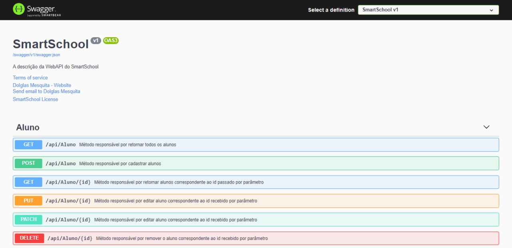

# SmartSchool WEB API
#### API desenvolvida acompanhando o curso de desenvolvimento de API com .NET Core

* API Documentada com Swegger
* Desenvolvida usando .NET Core Web API, C#,  Entity Framework Core, Banco de dados SQLite
